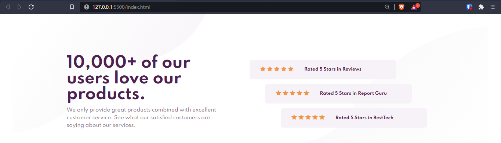
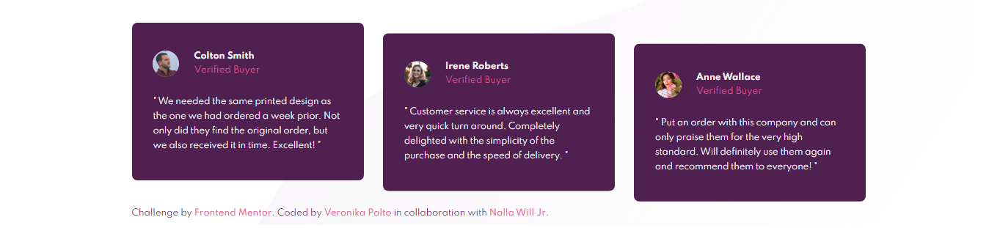
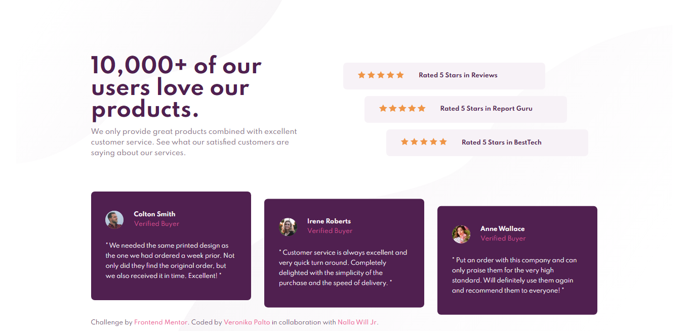
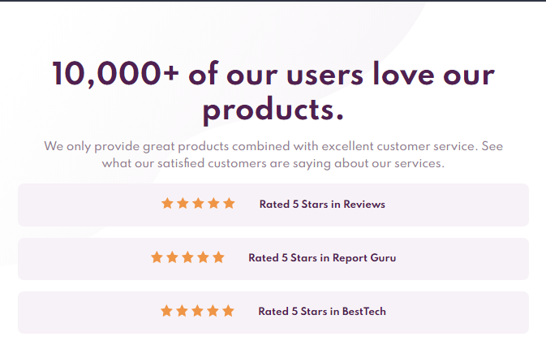
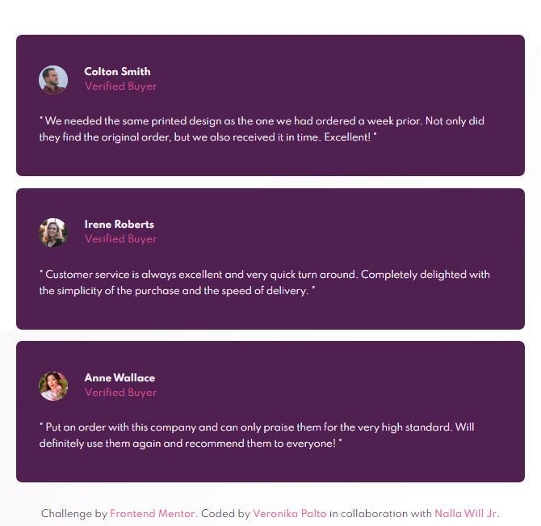

# Frontend Mentor - Social proof section solution

A collaborative project.

This is a solution to the [Social proof section challenge on Frontend Mentor](https://www.frontendmentor.io/challenges/social-proof-section-6e0qTv_bA). Frontend Mentor challenges help you improve your coding skills by building realistic projects.

## Table of contents

-  [Overview](#overview)
   -  [The challenge](#the-challenge)
   -  [Screenshots](#screenshots)
   -  [Links](#links)
-  [Our process](#our-process)
   -  [Built with](#built-with)
   -  [What we learned](#what-we-learned)
   -  [Continued development](#continued-development)
   -  [Useful resources](#useful-resources)
-  [Authors](#authors)

## Overview

### The challenge

The challenge is to build out this social proof section and get it looking as close to the design as possible.

Users should be able to:

-  View the optimal layout for the section depending on their device's screen size

### Screenshots

Screenshot of the part coded by [AllanKirui](#authors).

Screenshot of the part coded by [VeronikaPalto](#authors).

Screenshot of the general overview of the page.

Screenshots of the page in tablet view.

### Links

-  Solution URL: [Frontend Mentor](https://www.frontendmentor.io/challenges/social-proof-section-6e0qTv_bA/hub)
-  Live Site URL: [Netlify](https://practical-tereshkova-8c641d.netlify.app/)

## Our process
### Built with

-  Semantic HTML5 markup
-  CSS
-  Desktop-first workflow
-  [Inkscape](https://inkscape.org) - Inkscape: Open Source Scalable Vector Graphics Editor

### What we learned

-  [AK] - Feedback from [Veronika](#authors) about the part of the project that I coded has made me think more about building for scalability. I was able to implement her suggestions on making the styles for the ratings section applicable to any number of items in the section.

### Continued development

-  [AK] - I want to build future projects with scalability in mind, and also, to focus on making the projects efficient in terms of performance.

### Useful resources

-  [AK] - I use [Inkscape](https://inkscape.org) SVG Editor all the time when I'm working on any web project. For this project, I loaded the project designs into Inkscape and used it's in-built tools to figure out the _spacing_, _sizing_ and _positioning_ of elements throughout the project.

-  [AK] - To better understand how I approached coding the project using Inkscape, have a look at this repository I made - [Designing and Coding Layouts](https://github.com/AllanKirui/designing-and-coding-layouts)

## Authors

-  GitHub - [VeronikaPalto](https://www.github.com/JepardMay)
-  GitHub - [AllanKirui](https://www.github.com/AllanKirui)

[Back to top](#frontend-mentor---social-proof-section-solution)
